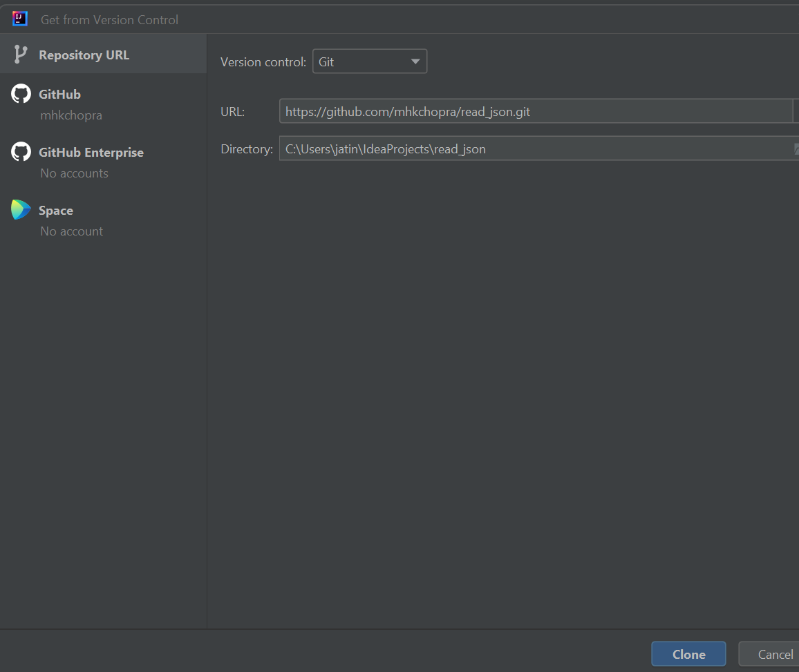
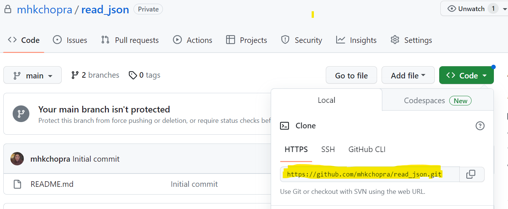
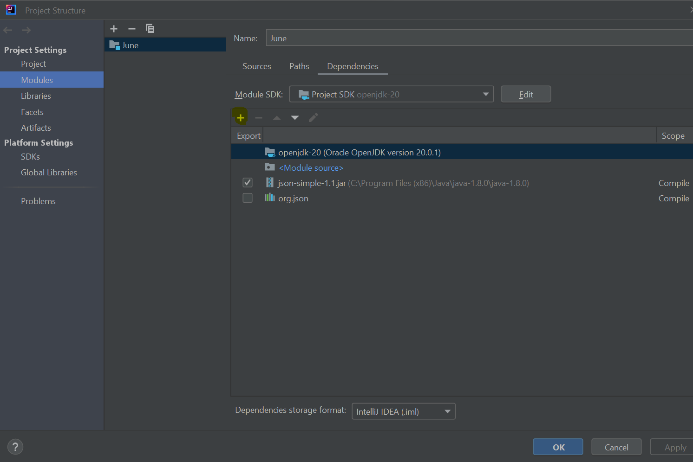
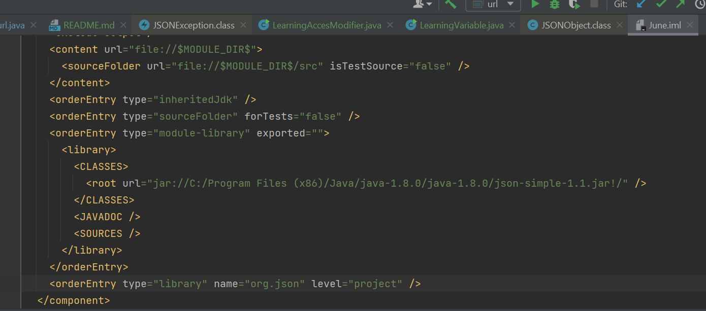

This is a Java program that demonstrates how to read, search, and validate information from a JSON API response. It uses the java.net.HttpURLConnection class to make a GET request to a specified URL and retrieves the JSON response. The program then parses the JSON data using the org.json library to extract and validate specific fields.

Installation
To run this program, you need to have Java Development Kit (JDK) and an Integrated Development Environment (IDE) like IntelliJ IDEA installed on your system. Follow the steps below to set up the environment:

Java Development Kit (JDK): Ensure that you have Java JDK installed on your machine. You can download the latest JDK version from the Oracle website (https://www.oracle.com/java/technologies/javase-jdk11-downloads.html) and follow the installation instructions.

IntelliJ IDEA: Download and install IntelliJ IDEA Community Edition (https://www.jetbrains.com/idea/download/) or Ultimate Edition if you have a license.

Clone the Repository: Clone the repository containing the Java code to your local machine using Git. From Intellij go to Git toolbar on the top > select clone as shown below > 

Enter the copied git path from Git hub and click on clone

Set Up Dependencies: The program uses the org.json library for parsing JSON data. To add this dependency to your project, open the project structure under file in IntelliJ IDEA and click on plus(+) button to add jar file. 

It will automatically add dependency in the .iml file as shown below.

Usage
Once the project is set up in IntelliJ IDEA, follow these steps to run the program:

Open the url.java file in the project.
Modify the url variable in the main method if you want to use a different API URL. By default, it is set to "https://api.tmsandbox.co.nz/v1/Categories/6327/Details.json?catalogue=false".
Run the program by clicking the green "Play" button next to the main method or right-clicking inside the code editor and selecting "Run 'main'".
The program will make a GET request to the specified URL, parse the JSON response, and perform text validations.
The results will be displayed in the console, indicating whether the validations passed or failed.

Dependencies
This project uses the following external library for JSON parsing:

org.json: A simple JSON library for Java. It provides classes for parsing, manipulating, and converting JSON data. The library is included as a dependency in the build.gradle file.
